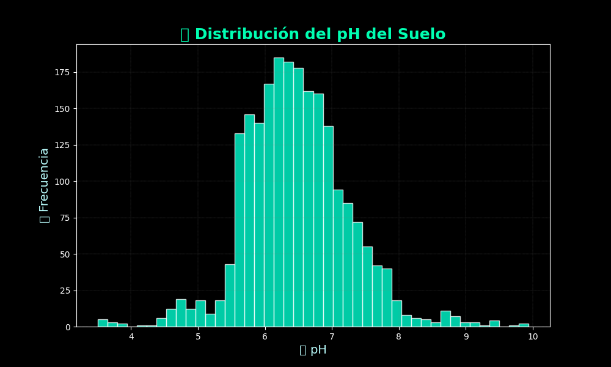

# Sowing In good land
# 🌱 Sowing in Good Land - Predicción de Cultivos con Machine Learning

Este proyecto utiliza machine learning para ayudar a un agricultor a determinar **el mejor tipo de cultivo** para sembrar, basado en mediciones del suelo como el contenido de **nitrógeno (N)**, **fósforo (P)**, **potasio (K)** y el **pH**.

## 📂 Dataset

El conjunto de datos `soil_measures.csv` contiene:

- `N`: Proporción de nitrógeno en el suelo
- `P`: Proporción de fósforo en el suelo
- `K`: Proporción de potasio en el suelo
- `ph`: Nivel de pH del suelo
- `crop`: Cultivo óptimo para ese suelo (variable objetivo)

Cada fila representa un análisis de suelo en un campo diferente.

---

## 🎯 Objetivo del Proyecto

1. Predecir el tipo de cultivo más adecuado según las condiciones del suelo.
2. Identificar **la característica (feature) individual más predictiva** para esta tarea.

---

## 🧠 Técnicas Utilizadas

- Análisis exploratorio de datos (EDA)
- Visualización con `matplotlib` y `seaborn`
- Matriz de correlación
- Clasificación multiclase con `LogisticRegression` (scikit-learn)
- Evaluación del modelo usando **accuracy**

---

## 📊 Visualizaciones

- Histograma del pH con estilo moderno/futurista 🌌
- 
- Heatmap de correlación entre nutrientes y pH

---

## 🔍 Resultado Clave

Tras entrenar modelos de regresión logística individuales para cada feature, se concluyó que:

```python
best_predictive_feature = {'P': 0.7034482758620689}

